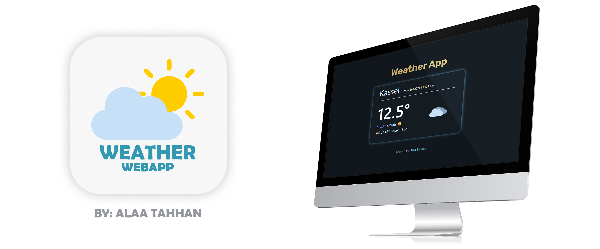

# Weather App by Alaa Tahhan



This is a simple weather app that allows users to search for cities and view the current weather as well as a short forecast for the upcoming days.<br>
[Click Here to View Demo](https://weatherapp-tahhan.netlify.app/)

## Features

- 🌐 **Live Weather Data:** Fetches real-time weather information based on the user's geolocation.
- 🔄 **Dynamic Icons:** Displays weather icons that change based on the weather conditions and time of day.
- 🌡️ **Temperature Conversion:** Shows temperatures in Celsius, converted from Kelvin on the fly.
- ⚠️ **Error Handling:** Robust error management for location services and API requests.
- 📱 **Responsive Design:** Optimized for different devices, ensuring a seamless user experience across platforms.

## Tech Stack

### Frontend Technologies

<div align="left">

<table>
  <tr>
    <td align="center"><br>React</td>
    <td align="center"><br>CSS</td>
  </tr>
</table>

</div>

### APIs

|                                                                                                                           | Title          | Description                                                        |
| ------------------------------------------------------------------------------------------------------------------------- | -------------- | ------------------------------------------------------------------ |
|                             | OpenWeatherMap | Fetches weather data including temperature, conditions, and icons. |
|  | API Ninjas     | Retrieves the city name based on latitude and longitude.           |

### Tools and Libraries

|                                                                             | Title | Description                                                     |
| --------------------------------------------------------------------------- | ----- | --------------------------------------------------------------- |
|  | Axios | Promise-based HTTP client for making requests to external APIs. |

## Setup and Installation

1. **Clone the repository:**
   ```bash
   git clone https://github.com/SoftwareEngineerAlaa/weather-app.git
   ```
2. **Navigate to the project directory:**
   ```bash
   cd weather-app
   ```
3. **Install dependencies:**
   ```bash
   npm install
   ```
4. **Run the application:**
   ```bash
   npm start
   ```
   This will run the app in development mode. Open [http://localhost:3000](http://localhost:3000) to view it in the browser.

## Usage

Simply open the app, and it will request permission to access your location. Once permitted, it will automatically fetch and display the weather data for your current location. You can see the current temperature, weather conditions, and minimum/maximum temperatures for the day.

## Possible Developments

- 🔍 Search bar for finding weather in different cities.
- 📅 Short weather forecast for eacn h day of the week.
- 🌟 Animated SVG for a more user-friendly interface.
- 🌍 Support for multiple languages such as Arabic, German, French, Spanish, Italian, Japanese, Turkish, etc.
- 🎯 Suggestions for activities based on the weather conditions.

## Contribution

Contributions to app development are welcome. Contributors retain copyright to their contributions, while others are granted the right to use, modify, and distribute the project under the MIT License.

## Acknowledgements

- **OpenWeatherMap API:** For providing comprehensive weather data.
- **API Ninjas:** For enabling accurate reverse geocoding features.

## Developer Contact

**Alaa Tahhan**

- [Portfolio](https://alaatahhan.netlify.app/)
- [GitHub](https://github.com/SoftwareEngineerAlaa)
- [LinkedIn](https://www.linkedin.com/in/alaa-tahhan/)

Thank you for exploring the Weather App!
